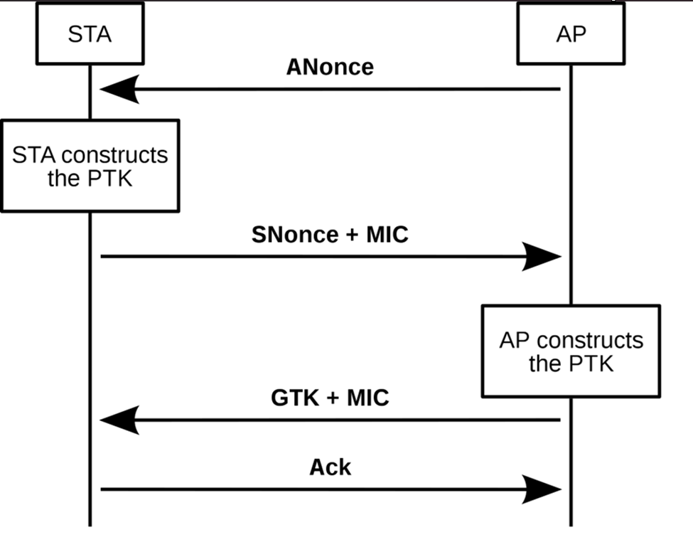

---
aliases:
  - PSK attacks
---
# PSK Attacks
PSK (pre-shared key) networks refer primarily to [WPA/WPA2](../../networking/wifi/WPA-WPA2.md) networks which use a PSK to authenticate users. PSK wifi networks *are the most common* even though [WPA3](../../networking/wifi/WPA3.md) is a better alternative. 

The security of PSK networks is congruent *with the strength of the password itself* (in most cases). However, other vulnerabilities can be introduced when the AP is *misconfigured*, or when users can be tricked into authenticating into a fake or rogue AP ([evil twin](evil-twin.md)).
## Theory
In PSK networks ([WPA/ WPA2](../../networking/wifi/WPA-WPA2.md)), the authentication process requires a PSK (pre-shared key). To protect the key and avoid *transmitting it over the network*, a handshake process is exchanged b/w the client and the AP.

Most PSK attacks therefore capture this handshake exchange and attempt to *crack the network password* by brute force and dictionary techniques.

- **Message 1**: Initiation by the AP: the AP sends an `EAPOL-Key` frame to the client. The frame includes a randomly generated nonce (`ANonce`), which is used in the *key generation process*
- **Message 2**: Client Response: the client replies w/ another `EAPOL-Key` frame carrying its nonce (`SNonce`) and a `MIC` (for integrity). Capturing message 1 and message 2 *is all an attacker needs to perform offline dictionary attacks against the PSK*.
- **Message 3**: AP Sends GTK: The AP sends another `EAPOL-Key` frame to the client. This frame contains the Group Temporal Key (`GTK`) which is encrypted with the `PTK` (generated by the client w/ message 2). The AP calculates the `PTK` to ensure both parties have matching keys.
- **Message 4**: Client Acknowledgement: the client sends a final `EAPOL-Key` frame to the AP. This frame serves as the acknowledgement that the client successfully received the `GTK` and *both the client and AP have derived the same PTK*. 