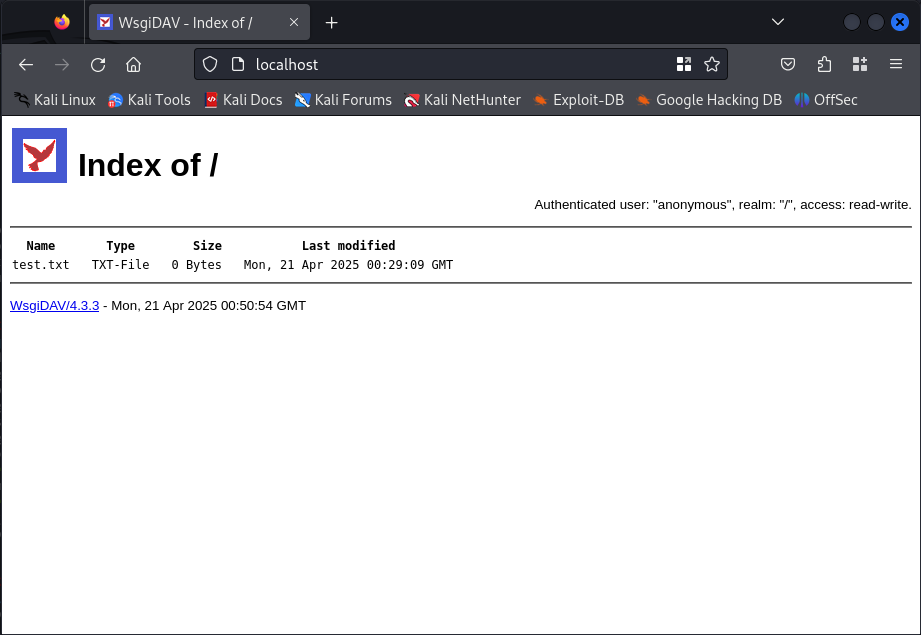

# Abusing Windows Library Files
Even though [macros](microsoft-word-macros.md) are used commonly in organizations, they are usually well protected against as well. A lesser known, and equally effective threat are Windows library files.
## What are Library Files
On Windows, library files are *virtual containers* used for user content. They're used for connecting users with data stored in local *or in remote locations* like web services or file shares. They have a `.Library-ms` file extension (file extensions are significant on Windows machines b/c they determine how a file will be executed by the system).

When you include an already existing folder into a library *it doesn't move the original folder* or change its storage location. Instead, the library holds *a view into the folder*. However, if you were to move, copy, or delete the files in the library, then you would *actually move/copy/delete* the actual file (they're not copies).
### Default Libraries
Some file locations are also libraries *by default*. This includes:
- The Documents folder
- Music
- Pictures
- Video

These are build on top of the legacy folders My Documents, My Pictures, My Music, etc.. So, when a user drags, copies, or saves a file to the "Documents" library, the file is also dragged, copied, or saved in the "My Documents" folder.
## Using libraries to gain a foothold
Our entire attack will be two stages. In the first stage, we'll use library files to gain the initial foothold. First, we need to setup a [WebDAV](../../www/WebDAV.md) share. Then, we'll create a library file which *connects to our WebDAV share*. Then, we'll deliver the library file to the victim. For this to work, the victim has to double click our file.

When the victim clicks the file, it will be downloaded and appear as a *regular folder in their Windows Explorer*. If they open the folder, they'll unknowingly be connected to our WebDAV share. On the WebDAV share, we'll have a `.lnk` shortcut file which will serve as our payload and set up the second stage.
### Setting up WebDAV Share
To setup our WebDAV share on Kali, we can use `WsgiDAV`. `WsgiDAV` will be a WebDAV server and will host our malicious files. We can install it with [python](../../coding/languages/python/python.md)'s `pip3`:
```bash
pip3 install wsgidav
```
Next, we need to create the directory which will serve as our WebDAV share and a `test.txt` file:
```bash
mkdir /home/trshpuppy/oscp/client-side/webdav

touch /home/trshpuppy/oscp/client-side/webdav/test.txt
```
Then, we can use the `wsgidav` command line tool we just installed to host our share:
```bash
/home/trshpuppy/oscp/client-side/wbvenv/bin/wsgidav --host=0.0.0.0 --port=80 --auth=anonymous --root /home/trshpuppy/oscp/client-side/webdav

Running without configuration file.
20:47:24.278 - WARNING : App wsgidav.mw.cors.Cors(None).is_disabled() returned True: skipping.
20:47:24.279 - INFO    : WsgiDAV/4.3.3 Python/3.13.2 Linux-6.8.11-arm64-aarch64-with-glibc2.38
20:47:24.279 - INFO    : Lock manager:      LockManager(LockStorageDict)
20:47:24.279 - INFO    : Property manager:  None
20:47:24.279 - INFO    : Domain controller: SimpleDomainController()
20:47:24.279 - INFO    : Registered DAV providers by route:
20:47:24.279 - INFO    :   - '/:dir_browser': FilesystemProvider for path '/home/trshpuppy/oscp/client-side/wbvenv/lib/python3.13/site-packages/wsgidav/dir_browser/htdocs' (Read-Only) (anonymous)
20:47:24.279 - INFO    :   - '/': FilesystemProvider for path '/home/trshpuppy/oscp/client-side/webdav' (Read-Write) (anonymous)
20:47:24.279 - WARNING : Basic authentication is enabled: It is highly recommended to enable SSL.
20:47:24.279 - WARNING : Share '/' will allow anonymous write access.
20:47:24.279 - WARNING : Share '/:dir_browser' will allow anonymous write access.
20:47:24.279 - WARNING : Could not import lxml: using xml instead (up to 10% slower). Consider `pip install lxml`(see https://pypi.python.org/pypi/lxml).
20:47:24.296 - INFO    : Running WsgiDAV/4.3.3 Cheroot/10.0.1 Python/3.13.2
20:47:24.296 - INFO    : Serving on http://0.0.0.0:80 ...
```
- `--auth=anonymous` disables authentication on our share
- `--root` tells `wsgidav` to use our new directory as the root of our WebDAV share
We can confirm our WebDAV server is running by visiting port 80 or our localhost in the browser:


> [!Resources]
> - [Microsoft: Windows Libraries](https://learn.microsoft.com/en-us/windows/client-management/client-tools/windows-libraries)