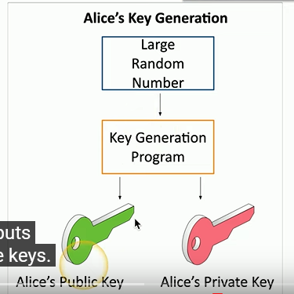

# Asymmetric Encryption
Also called 'public key cryptography'. There are two (or more) keys which are *mathematically related*. Usually, one key is *private* while the other is *public*.
## Key Pairs
### Public Key
This key is literally public and is usually unique to an individual or entity. Usually, the public key is *used to encrypt the data*. This key is meant to be shared.
### Private Key
The private key is the *only key which can decrypt data encrypted by the public key* (usually, it can go the opposite way). The private key is *related to the public key* but **cannot be derived from it**.
### Creating the keys
In general, the process for generating both keys looks something like this:

A large, random number is generated, which then goes through a program which uses it to generate the two keys.
## Encryption Process
If Bob wants to send an encrypted message to Alice, he needs to encrypt the plaintext message *using Alice's public key*. Then, when the ciphertext reaches Alice, she can decrypt it *using her private key* (which is the only way the text can be decrypted).
### Using Asymmetric Encryption to create *symmetric keys*
Because it's difficult to share [symmetric](symmetric-encryption.md) keys, one way to get around this is tho use asymmetric encryption to generate the symmetric key. For example, if Bob and Alice want to both have the same symmetric key, they can *create one* by combining their private and public keys.

## Types of Asymmetric Encryption
### Elliptic Curve Cryptography (ECC)
Asymmetric encryption *requires large integers* made up of 2 or more large prime factors. This means it *requires a lot of processing power* in order to do the math to encrypt and decrypt data. With ECC, instead of using numbers, *curves are used*.

This means the keys are much smaller and require *less storage*, which is especially good *for mobile devices*.
### Web Server Encryption ([TLS](../../../networking/protocols/TLS.md)/[SSL](../../../networking/protocols/SSL.md))
Traditionally, web server's have used [RSA](RSA.md) key pairs for encrypting traffic (when using [HTTPS](../../../www/HTTPS.md)). The web server has a private key which *encrypts all symmetric keys* as well. Because of this, the single private key becomes a *single point of failure* b/c if it's leaked or stolen, it can be used to unencrypt all traffic and symmetric keys.

To get around this, web servers have been implementing *Perfect Forward Secrecy (PFS)*. With PFS, the server doesn't use a private RSA key, instead, it uses *Elliptic Curve/  [Diffie-Hellman](diffie-hellman.md) Ephemeral* (ECDHE_RSA) to create keys which are *specific to that session*. Once the session ends, the keys are thrown away.

Additionally, *nothing can be decrypted w/ the server's private key* since every session has a new key pair that's deleted afterwards. Even though this is more secure, it also *requires more computing power* so not all servers do this. Also, the browser has to be able to support it (most modern ones do).

> [!Resources]
> - [Professor Messer](https://www.youtube.com/watch?v=h-9QKN4a7Oo&list=PLG49S3nxzAnkL2ulFS3132mOVKuzzBxA8&index=94)

