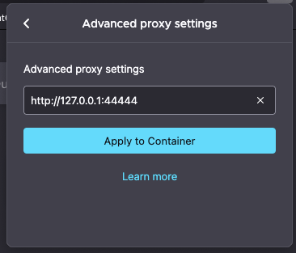

# Burp Suite
Init.
## Burp Proxy
The [proxy](../../../../networking/design-structure/proxy.md) tool intercepts requests and responses between the Burp browser (or whatever browser you configure it to proxy through) and the target wep application/ host. It allows you to not only read requests and responses but also to *modify requests* before they're sent to the target.
### Setting up a proxy
Usually, Burp starts and is pre-configured to use its built-in browser as the proxy. You can see this if you go to Settings --> Proxy. The 'Proxy Listener' will likely be set to `127.0.0.1:8080`. This means that when you open Burp's Browser, the traffic Burp sends to whatever host you visit in the browser will be sent Burp's listener on your [loopback](../../../../networking/routing/loopback.md) interface (on port 8080). 

You can configure Burp to use a different browser, such as Firefox, by configuring Firefox to do that. For example, if you have the Firefox extension "Firefox Multi-Account Containers", you can create a new container and edit its proxy settings. Let's say you edit the proxy settings to "http://localhost:44444", then in BurpSuite, just add `127.0.0.1:44444` as a listener and voila.

> [!Resources]
> - my bren