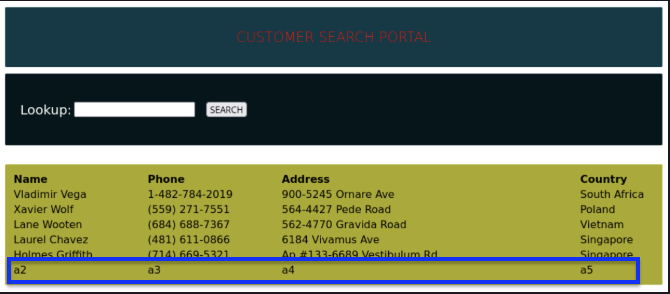
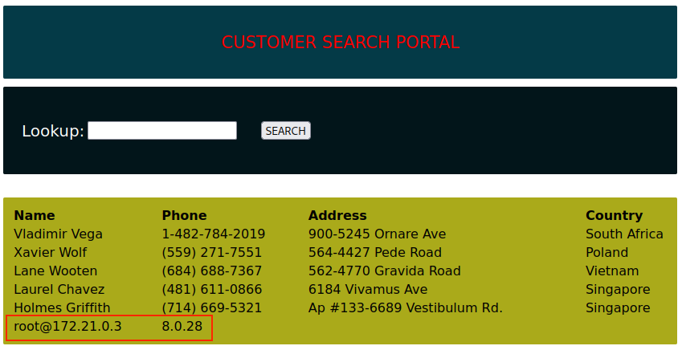
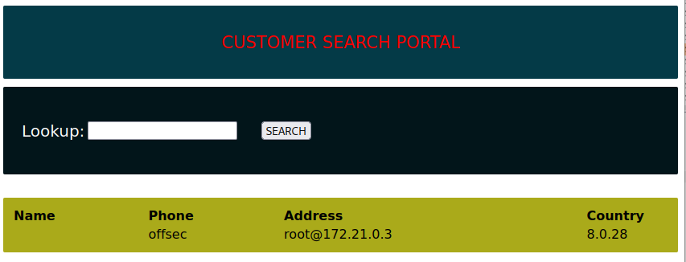

# MySQL UNION Attack
When an attacker uses the [SQL](/coding/languages/SQL.md) `UNION` keyword to retrieve data from more than one table in the database. This vuln should be tested for whenever a [SQLi](SQLi.md) resultes in the returned balue *being displayed by the application* in response. 
## UNION keyword
In SQL the `UNION` keyword allows you to execute more than one `SELECT` query and append the results to the original query. The injected `UNION` query has to have the *same number* of columns as the original query and the data types need to be *compatible* with each other.
### Attack requirements
1. The # and order of columns which appear in all SELECT statements must be the same
2. The data types of the columns must be the same or compatible
#### Sample Tables:
```sql
DROP TABLE IF EXISTS t1;
DROP TABLE IF EXISTS t2;

CREATE TABLE t1 (
    id INT PRIMARY KEY
);

CREATE TABLE t2 (
    id INT PRIMARY KEY
);

INSERT INTO t1 VALUES (1),(2),(3);
INSERT INTO t2 VALUES (2),(3),(4);
```
##### Return result sets from `t1` and `t2`
```sql
-- Query:
SELECT id FROM t1 UNION SELECT id FROM t2;

-- Output:
+----+
| id |
+----+
|  1 |
|  2 |
|  3 |
|  4 |
+----+
4 rows in set (0.00 sec)
```
## Example
If a website has the following pre-configured SQL query:
```php
$query = "SELECT * from customers where name like '".
$_POST["search_input"]."%'";)
```
This query fetches all the records from a table called `customers` and uses the `like` keyword to search it for any name values containing the input (supplied by the user which is followed by zero or any number of characters (specified by `%`)). The percent sign `%` is a *wildcard* character used with the `like` keyword. It represents 1, zero, or multiple characters in a text or string search.

For this example, pretend that the vulnerable web application has a customer search portal which will return names of customer's along with their phone number, address, and country. Before attacking the portal with a UNION attack we need to know *the exact number of columns* present in the table. Even if the web application is showing us four columns (name, phone, address, country) it may not be showing us *all of the columns* in the actual table.
### Discovering Number of Columns
To discover the exact number of columns in the table, we can inject the following query:
```sql
' ORDER BY 1-- //
```
This statement will cause the results to be ordered by a specific column *but will fail if the column doesn't exist*. For example, if the table has five columns, then `ORDER BY 6` will return an error since there isn't a sixth column to return. The error will likely read something like:
```sql
Unknown column '6' in 'order clause'
```
Now we know there are 5 total columns in the table. Next we need to determine which ones are displayed normally. For example, entering `' order by 99-- //` into the Username field causes this web application to respond with:

### Discovering Which Columns are Displayed
To discover which columns are normally displayed, we can use the `UNION` keyword:
```sql
%' UNION SELECT 'a1', 'a2', 'a3', 'a4', 'a5' -- //
```
Using the `%` and a single quote will allow us to retrieve *all of the data* from the `customers` table. The `%'` will *close off the search parameter* in the web application's code (see above). 

The query essentially appended the original query with 5 values that we created, which you can see at the bottom of each column. Now we know that the first column in the table is the only column we can't see. This is normal because the first column is *usually reserved for each item's ID*. 
### Enumerating with UNION
Now we can use a UNION attack to enumerate more information from the database and MySQL service running it:
```sql
%' UNION SELECT database(), user(), @@version, null, null -- //
```
In this injection, we're asking for 5 pieces of information to be appended to the original query. `database()` should give us the current database's name. `user()` should return the current user. `@@version` should tell us the version of MySQL running. Then we give two `null` values as placeholders (since the UNION query statement has to return the same number of columns as the query its appended to).

The first column (where we expect to see `database`) does not show, so we need to fix our query and put the `database()` function in one of the `null` positions instead. Additionally, we don't need the `%` sign anymore since we've figured out how many columns there are and which ones are showing:
```sql
' UNION SELECT null, null, database(), user(), @@version -- //
```
Now, we'll only see the results from our appended query instead of the entire database (since we took out the `%`):

### Enumerating with UNION and the Information Schema
Now that we've confirmed the web app is vulnerable to UNION attacks, we can leverage this vuln to verify whether *other tables* are present in the database. We can do this by enumerating the database's *[`information_schema`](../../../../CLI-tools/linux/mysql.md#`information_schema`)* (a table in every [MySQL](../../../../CLI-tools/linux/mysql.md) server which holds metadata about the MySQL server). 

We can use `information_schema` to check its `columns` table. This will tell us what columns exist in each table on the server. In our injected query, we'll ask for each table's name, column names, and table schema. We'll leave the first and fifth items set to null:
```sql
' union select null, table_name, column_name, table_schema, null from information_schema.columns where table_schema=database() -- //
```

The output tells us that the database `offsec` has two tables, `users` and `customers`. The `customers` table has 5 columns (as we already determined), and the `users` table has 4: `id`, `username`, `password`,  and `description`.
### Using UNION to Dump Additional Databases
Now we can craft an injected query to dump the `users` table, since we obviously want all of the user's paswords!
```sql
' UNION SELECT null, username, password, description, null FROM users -- //
```


> [!Resources]
> - [My SQL Tutorial: Union Attacks](https://www.mysqltutorial.org/sql-union-mysql.aspx/)
> - [Port Swigger](https://portswigger.net/web-security/sql-injection/union-attacks)
> - [MySQL Documentation](https://dev.mysql.com/doc/refman/8.0/en/information-schema-introduction.html)

