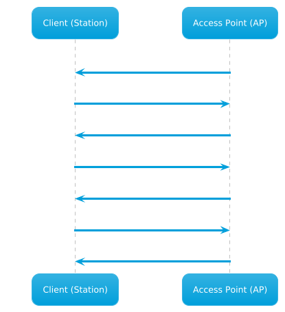

---
aliases:
  - wifi authentication
---
# Wifi Authentication
There are two primary kinds of authentication used in Wifi networks:
- **Open System Authentication**: does not require a shared secret/ key/ or credentials. Usually used in *open networks* where no password is needed and allows *any device to connect* w/o verification
- **Shared Key Authentication**: Involves a shared key - both the client and access point verify each other by computing a *challenge-response* based mechanism based on the pre-shared key. This includes WEP, WPA, and [802.11](802.11.md)/ WPA2
## Basics
For a device to connect to a wi-fi network, it has to go through *authentication* and *association*.

### Wi-Fi Probes
*Wi-Fi Probes* are messages sent by wireless devices to *discover networks within their range*. Devices can send:
- Active probes: Explicitly request information from specific networks
- Passive probes: Passively listen for the *beacons* that access points periodically transmit
### Wi-Fi Authentication
In order to authenticate a client device to a network, the client and Access Point (AP) perform an initial authentication using an*open authentication mechanism*. First, the client sends an auth message to the AP, then the AP responds w/ a confirmation. *No verification is done during this stage*. Verification like PSK is done in *later stages*. 
### Wi-Fi Association
Once the client device is authenticated to the AP, the association phase beings. In this phase the [data-link-layer](../OSI/2-datalink/data-link-layer.md) connection is established b/w the AP and the client. 

During association, the client sends information to the AP which includes:
- supported data rates
- device capabilities
Then the AP responds with an *association response*, either accepting or rejecting the request. If accepted, the response includes information about the agreed upon data rates and other configurations.
## Networks by Encryption Type
### Open System Auth
Wifi networks using open auth *do not require a password* or other pre-shared secret. Connection b/w clients and the access point usually follows this order:
1. The client sends an auth request to the access point
2. The AP sends the client back an auth response indicating whether or not the request was accepted
3. The client sends an *association request* to the AP
4. The AP responds with an association response indicating whether the client can stay connected
### Shared Key Auth
Unlike open auth systems, wifi networks using shared key-type auth require clients to auth using some kind of shared secret. *Both the client and AP have to prove their identities* by computing a challenge based on the shared secret.

Both WPA and WEP use this as it provides a basic level of security. WPA2 builds on it by using stronger encryption (AES) etc.
### WEP Authentication
In a WEP wifi network, authentication is carried out using the following steps:
1. *Authentication request*: Initially, as it goes, the client sends the access point an authentication request.
2. *Challenge*: The access point then responds with a custom authentication response which includes challenge text for the client.
3. *Challenge Response*: The client then responds with the encrypted challenge, which is encrypted with the *WEP key*.
4. *Verification*: The AP then decrypts this challenge and sends back either an indication of success or failure.
### WPA Authentication
Unlike WEP, WPA uses a *four-way handshake* for authentication. In a WPA four way handshake, the *association* portion of the exchange is replaced with a more complex verification process:
1. *Authentication Request*: The client sends an authentication request to the AP to initiate the authentication process.
2. *Authentication Response*: The AP responds with an authentication response, which indicates that it is ready to proceed with authentication.
3. *Pairwise Key Generation*: The client and the AP then calculate the PMK from the PSK (password).
4. *Four-Way Handshake*: The client and access point then undergo each step of the four way handshake, which involves nonce exchange, derivation, among other actions to verify that the client and AP truly know the PSK.
### WPA3 Authentication
WPA2 is the newest and most secure connection standard for wifi. It introduces improvements including better encryption and enhanced protection *against [brute-force](../../cybersecurity/TTPs/cracking/brute-force.md) attacks* by using something called *Simultaneous Authentication of Equals* (SAE).

SAE replaces Pre-Shared Key (PSK) methods used in WPA2 and provides better protection for passwords and individual connection sessions.

Unfortunately, adoption of WPA2 has been slow because it is *limited by hardware restrictions*. Many devices *do not support WPA3* and require firmware updates or replacements to be compatible. This makes it difficult to implement, especially in networks with widespread use of legacy machines.

> [!Resources]
> - [HTB Academy: Wifi Pentesting Basics](https://academy.hackthebox.com/module/222/section/2404)